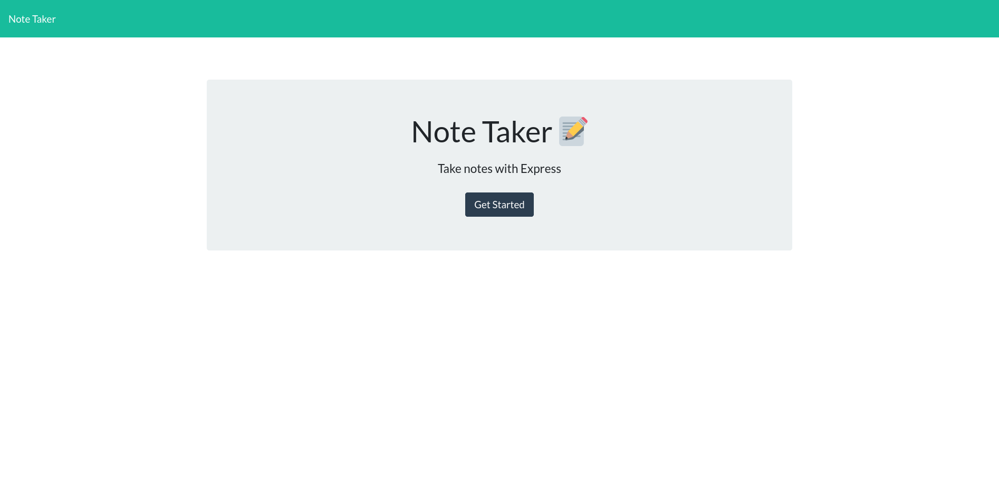
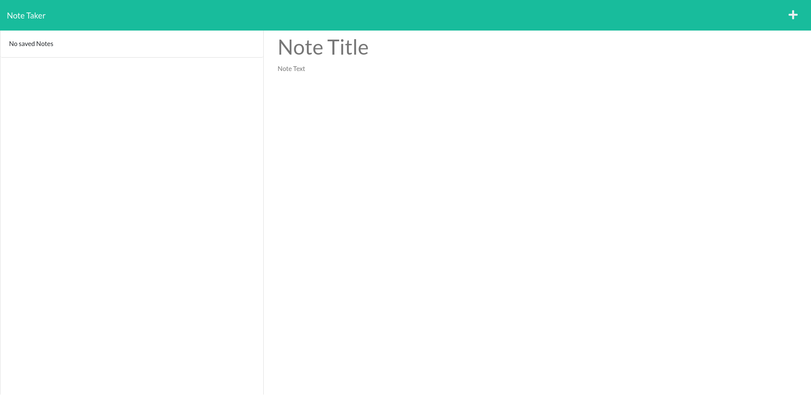

# Note Taker

  ## Table of Contents ##
  * [Description](#description)
  * [Installation](#installation)
  * [Usage](#usage)
  * [Contact](#contact)

  ## Description ##
  This is application for taking notes using express.js node package. It uses json storage to save notes. \
  Example photos of application:
  \
  

  ## Installation ##
  Clone repo and install required npm modules using 'npm i'

  ## Usage ##
  Manage daily tasks or TODO's with this note taker. You can save and delete notes at ease. Give your note a title and view the various notes after saving by selecting the title of the note you wish to view. The trash can icon can be used to delete a specific note on click.

  ## Contact ##
  * Email: thomas.spaeth01@gmail.com
  * GitHub: [https://github.com/ModestTom](https://github.com/ModestTom)
